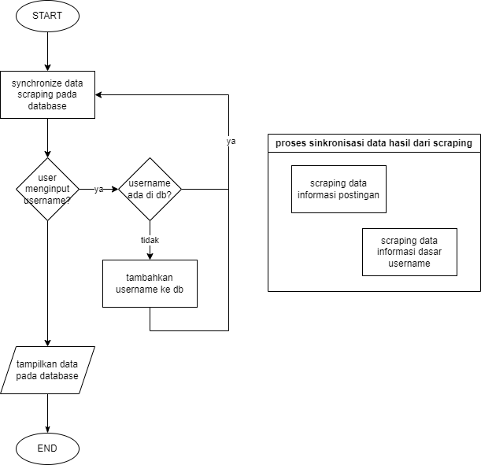

# api-influencers-ig

## :notebook_with_decorative_cover: Description
Using instaloader library this API will scrap this following data:
- username
- followers
- following
- total posts
- total likes
- total comments
that can be user to analysis engagment rate.
The flow of program can be descripted at this flowchart below:

  

## :up: Next Update
Create dashboard to analyst the results of scraping
